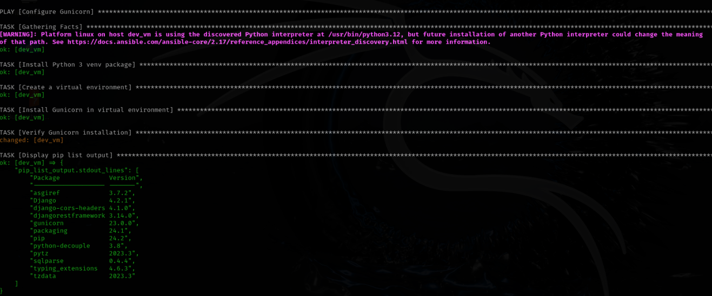

# Ansible Playbooks for Django App Deployment and Configuration

This repository includes a set of Ansible playbooks designed for deploying and configuring a Django application along with its required dependencies. Each playbook focuses on a specific aspect of setting up the environment, deploying the application, and configuring services like Gunicorn, Docker, and GitLab.

## Playbooks Overview

### 1. `configure_gunicorn.yml`

This playbook sets up Gunicorn to serve the Django application.

# Playbook: Configure Gunicorn

This Ansible playbook configures Gunicorn, a WSGI HTTP server for UNIX, to run a Django application within a virtual environment.

### Prerequisites

- Python 3 must already be installed on the target system.
- The target machine should use the `apt` package manager (common for Debian-based systems).
- The target system must have access to the necessary Python packages such as `python3-venv` and `gunicorn`.

### Playbook Overview

The `configure_gunicorn.yml` playbook performs the following tasks:

1. **Install the Python 3 Virtual Environment Package**  
   This step installs the `python3-venv` package, which is required for creating a Python virtual environment.

2. **Create a Python Virtual Environment**  
   A virtual environment is created in the `/opt/django_app/venv` directory to keep the Django application and its dependencies isolated.

3. **Install Gunicorn in the Virtual Environment**  
   Gunicorn is installed within the virtual environment using `pip` to ensure compatibility with the Django application.

4. **Verify Gunicorn Installation**  
   This task runs `pip list` within the virtual environment to check if Gunicorn was successfully installed.

5. **Display Gunicorn Installation Output**  
   The playbook outputs the result of the `pip list` command, listing all installed Python packages in the virtual environment, confirming that Gunicorn is installed.

  

### 2. `install_docker.yml`

## Overview

This repository contains Ansible playbooks for automating the deployment of a Django application on a remote server using Docker. The tasks in the playbooks include cloning a GitLab repository, installing Docker, and deploying the Django app via Docker Compose. The playbooks are structured for easy configuration and secure management of credentials.

### Playbooks

1. **`install_docker.yml`**: This playbook installs Docker and Docker Compose on the remote server.
2. **`deploy_django_app.yml`**: This playbook clones the Django application repository, installs the required dependencies, and deploys the application using Docker Compose.

## Playbook Details

#### Purpose

The `install_docker.yml` playbook automates the installation of Docker and Docker Compose on a remote server. It ensures that Docker and Docker Compose are installed and ready for use.

#### Steps

1. **Install Docker**:  
    The playbook installs Docker from the official Docker repository.
2. **Install Docker Compose**:  
    Docker Compose is installed by downloading the binary from GitHub and placing it in `/usr/local/bin/`.
3. **Start and Enable Docker Service**:  
    The Docker service is started and enabled to run on boot, ensuring that the Docker service is always up when the system restarts.

  
  

### 3. `install_python.yml`

## Overview

The `install_python.yml` playbook automates the installation of Python 3 and pip (Python's package installer) on remote servers. The playbook works with Ansible's `apt` module to update the package list and install the necessary Python packages on a Debian-based system (e.g., Ubuntu).

## Purpose

This playbook ensures that the remote servers, specified in the `dev_vms` group, have Python 3 and pip 3 installed and ready for use. These tools are essential for managing Python applications and dependencies.

## Playbook Details

### Steps

1. **Update Package List**:  
    The playbook starts by updating the system's package list to ensure the latest versions of available packages are installed.
2. **Install Python3 and pip3**:  
    The playbook installs both Python 3 and pip 3 in a single task. It uses a loop to install both packages: `python3` (the core Python 3 interpreter) and `python3-pip` (the Python package installer).

### Playbook Operation

  
  

### 4. `install_gitlab.yml`

# Playbook: Install GitLab Runner

This Ansible playbook installs and configures GitLab Runner on a remote server, allowing you to register and run jobs for your GitLab CI/CD pipelines.

### Prerequisites

- The target machine should be running a Linux-based operating system (e.g., Ubuntu, Debian).
- Ensure that the target machine has internet access to download the GitLab Runner binary.
- The `dev_vms` host group should be defined in your Ansible inventory file.

### Playbook Overview

The `install_gitlab.yml` playbook performs the following tasks:

1. **Download the GitLab Runner Binary**  
   This task downloads the latest GitLab Runner binary from GitLab’s official repository and places it in the `/usr/local/bin` directory.

2. **Register GitLab Runner as a Service**  
   Registers the GitLab Runner as a service so it can be managed using systemd. This task ensures that the runner is ready to start and join the GitLab instance.

3. **Start GitLab Runner Service**  
   Starts the GitLab Runner service and ensures it is enabled to start on boot.

### Playbook Breakdown

  

# Playbook: Install GitLab Runner

This Ansible playbook installs and configures GitLab Runner on a remote server, allowing you to register and run jobs for your GitLab CI/CD pipelines.

### Prerequisites

- The target machine should be running a Linux-based operating system (e.g., Ubuntu, Debian).
- Ensure that the target machine has internet access to download the GitLab Runner binary.
- The `dev_vms` host group should be defined in your Ansible inventory file.

### Playbook Overview

The `install_gitlab.yml` playbook performs the following tasks:

1. **Download the GitLab Runner Binary**  
   This task downloads the latest GitLab Runner binary from GitLab’s official repository and places it in the `/usr/local/bin` directory.

2. **Register GitLab Runner as a Service**  
   Registers the GitLab Runner as a service so it can be managed using systemd. This task ensures that the runner is ready to start and join the GitLab instance.

3. **Start GitLab Runner Service**  
   Starts the GitLab Runner service and ensures it is enabled to start on boot.

### Playbook Breakdown

### 5. `install_dependencies.yml`

# Playbook: Install Application Dependencies

This Ansible playbook automates the installation of the necessary dependencies for a Django application. It ensures that the Python virtual environment is created, the required packages are installed, and the `requirements.txt` file is copied to the server.

### Prerequisites

- The target machine should be running a Linux-based operating system (e.g., Ubuntu, Debian).
- Ensure the target machine has internet access for downloading the required packages.
- The `dev_vms` host group should be defined in your Ansible inventory file.

### Playbook Overview

The `install_dependencies.yml` playbook performs the following tasks:

1. **Gather Facts**  
   Collects system information, which is useful for making decisions about system configuration.

2. **Install Python 3 venv Package**  
   Ensures that the Python 3 virtual environment package (`python3-venv`) is installed.

3. **Create a Virtual Environment**  
   Creates a Python virtual environment at `/opt/django_app/venv` to isolate dependencies from the system Python installation.

4. **Copy `requirements.txt` to the VM**  
   Copies the `requirements.txt` file containing the list of Python dependencies to the server.

5. **Install Python Dependencies**  
   Installs the required Python packages in the virtual environment using `pip` and the `requirements.txt` file.

### Playbook Breakdown

  

# Dockerfiles explained and composing them in cloud ubuntu environment with ansible to deploy web application:

Client-side Dockerfile:  

Server-side Dockerfile:  

Web application:  

